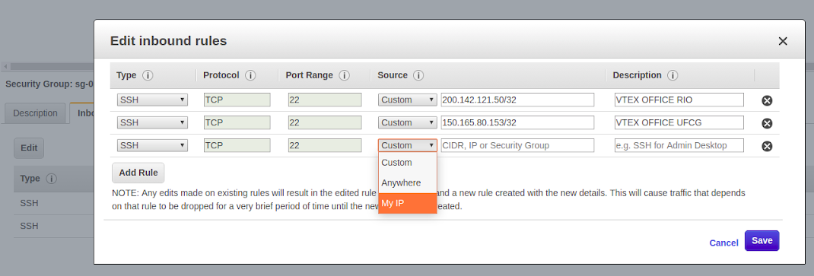
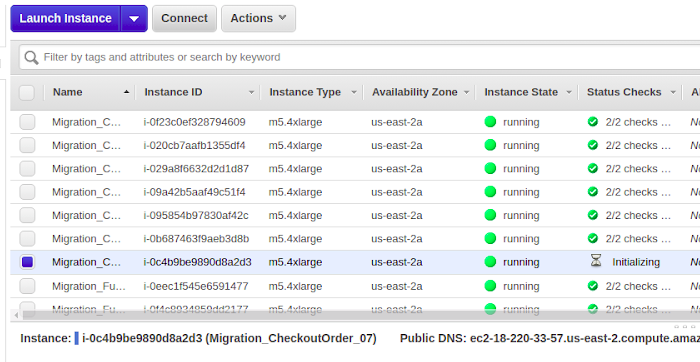
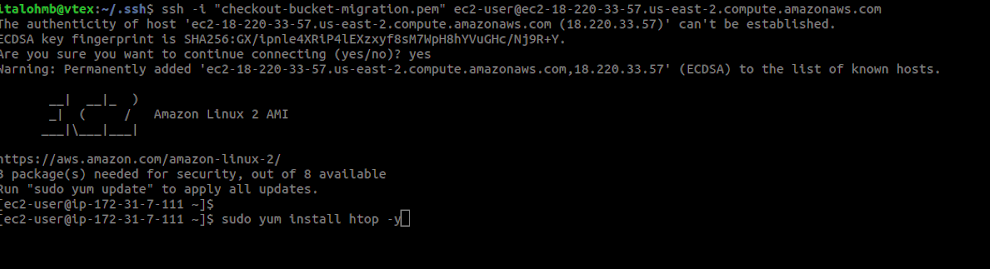

#  Checkout Historical Data Migration

## **Index**

- [1. Preamble](#1.-Preamble)
- [2. Data Migration](#2.-Data-Migration)
    - [2.1 Permissions](#2.1-Permissions)
    - [2.2 Ordering instances](#2.2-Ordering-instances)
    - [2.3 Copying files](#2.3-Copying-files)
        - [2.3.1 Connecting to the instance](#2.3.1-Connecting-to-the-instance)
        - [2.3.2 Syncing data](#2.3.2-Syncing-data)
- [3 Data Transformation](#3-Data-Transformation)
    - [Faced problems](#Faced-problems)

## 1 Preamble

After implementing _pipeline_ for structuring and partitioning Checkout data, every new order you create is now saved in a first version ready for consumption / query in your Analytics account. However, we still had the need to retrieve all orders datas dated before implementing our _pipeline_. In this regard, this document describes how the Checkout historical data migration process took place and how we transformed this data to have the same format as that produced by _pipeline_ for datalake.

## 2 Data Migration

Checkout data is originally saved on an s3 bucket in Virginia region. The bucket in the Analytics account where we save transformed data is saved in Ohio region. So the problem we are trying to solve in this part is **copying data between buckets in different regions and in different accounts**.

For migration, we used EC2 service to provision **16 instances** of high capacity  (**type: m5.4xlarge, with 16 VCPus, 64 Mem**). Why 16 instances? We would copy 512 folders in total from the source bucket (216 checkoutOrder folders and 216 fulfillmentOrder, according to the bucket folder structure). We decided that each machine would be responsible for copying 32 folders, so 16 * 32 = 512. We reached to  number 32 after a few experiments, and we realized that one machine could copy 32 folders within one day, which we could tolerate.

### 2.1 Permissions

First and foremost, permissions must be granted for specific services  in order to data be copied between different accounts. In our case, two permissions need to be declared:

1. The data source bucket (in this case, the Checkout one) must have a bucket policy attached to it. It can be  accomplished by accessing the Permissions / Bucket Policy menu. The bucket policy should look something like:

```json
{
   "Version": "2012-10-17",
   "Statement": [
      {
         "Sid": "Migrate checkout objects to datalake",
         "Effect": "Allow",
         "Principal": {
            "AWS": "arn:aws:iam::<iam-id>:root"
         },
         "Action": [
            "s3:*"
         ],
         "Resource": [
            "arn:aws:s3:::<source-bucket>",
            "arn:aws:s3:::<source-bucket>/*"
         ]
      }
   ]
}
```
This policy _allows any s3 action_ on the indicated bucket.

> **WARNING**: Obviously, this policy should be used with caution. Therefore, immediately after the data copying process has been completed, it should be deleted.

2. When creating instances, you must associate them with an IAM Role that gives **s3: fullAcess**. We will cover that point again later.

3. It is also necessary to add a bucket policy at the target bucket. This policy needs to allow list, get and put actions.

```json
{
    "Version": "2012-10-17",
    "Statement": [
        {
            "Sid": "Stmt1563475184681",
            "Effect": "Allow",
            "Principal": {
                "AWS": [
                    "arn:aws:iam::282989224251:role/EMR_EC2_DefaultRole",
                    "arn:aws:iam::282989224251:role/EMR_DefaultRole"
                ]
            },
            "Action": [
                "s3:Get*",
                "s3:List*",
                "s3:Put*"
            ],
            "Resource": [
                "arn:aws:s3:::target-bucket",
                "arn:aws:s3:::target-bucket/*"
            ]
        }
    ]
}
```

### 2.2 Ordering instances

First, you need to ensure that you are ordering an instance that is in the same region as the source bucket (for VTEX, this region is usually virgin / us-east-1). Using the UI, you can change the region in the middle menu in the upper right corner of the screen.   
Access EC2 on AWS and click _Launch Instance_.

1. Select the following AMI: `Amazon Linux 2 AMI (HVM), SSD Volume Type`. _Next_.
2. Select the following instance type: `m5.4xlarge`. _Next_.
3. Indicate:
     - Number of instances: 16
     - In IAM Role, indicate or create one that gives s3: FullAcess (as we mentioned earlier).
4. Go to next step.
5. Add the appropriate tags.
6. Select or create a new security group. It is important that in the security group used there is a rule that grants SSH access to your ip.
     - To edit an existing group, click on the security group.
       - In the Inbound tab, click Edit to add a new rule (SSH, TCP, 22, My Ip) and Save.
       - 
    - If you want to create a new security group, add rules that give you ssh access as commented above.
7. Review the information and click `Launch` (select or create a new security key).

### 2.3 Copying files

To copy the data from the source bucket, you must execute a `aws cli` command called` sync`. The instance created in the previous step already comes with aws cli installed (because of the AMI selected in step 1). Run the command within the instance.

#### 2.3.1 Connecting to the instance

Go back to the EC2 home page, click "Instances", select the instance you created, click "Connect", read the instructions and play them back.



NOTE: You must have the key indicated in step 7 to access the machine.

Open the terminal, access the instance. Install the htop command.



#### 2.3.2 Syncing data

For each instance, run the 32 commands (each command representing the sync of a folder) assigned to it.

Sync command ex:
`` `
aws s3 sync --quiet <s3: source_path> <s3: target_path> &
`` `

Follow the data transfer process on EC2/instance/monitoring or using htop.

This document is based on [docs](https://docs.google.com/document/d/1LFyubm8vLXcrdPxL09WxzKsvQ-HMmirGIqZBZazuCf0/edit#) created when specific checkout data is migrated.


## 3 Data Transformation

Once copied to the Analytics account, Checkout data is raw. They need to be transformed (structured) and partitioned. Since this is a very large dataset (approx 4 terabytes), we decided to use a [script](https://github.com/vtex/datalake/tree/master/aws/EMR/partitioning_history_checkout_data) in pyspark.
To run spark jobs, we decided to do it in the context of a cluster created with aws EMR service. But with which configuration to create this cluster, so as to best utilize machine resources and finish processing successfully?
Throughout the experiments we have had some memory overflow issues or resource misuse or excessive run time issues required to complete jobs. After some testing, we come to the following configuration:

We required 32 clusters, each with the following configuration:
   - 1 machine r5.2xlarge type Master 
   - 2 machines c5.4xlarge type Core

> **WARNING**: Importantly, when using machines with large resources, spark does not always run jobs using this avaible resources. You must explicitly state the amount of memory spark can consume, the amount of parallelization (CPU's), etc. Therefore, we use [this script](https://github.com/vtex/datalake/blob/master/aws/EMR/partitioning_history_checkout_data/gen_config_cluster_spark.py) to configure clusters to best use instance resources.

Each cluster is responsible for transforming 16 folders ("divide and conquer"). For example:
- cluster A gets the folders 00_CheckourtOrder, 01_CheckoutOrder, ..., 0E_CheckoutOrder, 0F_CheckoutOrder
- cluster B is responsible for 40_FulfillmentOrder, 41_FulfillmentOrder, ..., 4E_FulfillmentOrder, 4F_FulfillmentOrder.

Each folder must correspond to a spark job. Therefore, once a cluster is created, each folder must have an associated _step_. This _step_ means exactly submitting the partitioning script to a folder (eg 41_FulfillmentOrder). This is possible because [script](https://github.com/vtex/datalake/tree/master/aws/EMR/partitioning_history_checkout_data) takes a folder as an argument ([read](https://github.com/vtex/datalake/tree/master/aws/EMR/partitioning_history_checkout_data) more about how the script works). We use _[another script](https://github.com/vtex/datalake/tree/master/scripts/checkout_partition_history)_ to create all the clusters needed to transform and partition Checkout data, indicating in each one already a step specific to a subfolder, passed as an argument.

### Faced problems 

Some problems arose during the cluster transformation and configuration processes. Here we will report what these problems were and how we solved them.

The process of structuring the checkoutOrder data went smoothly with the data itself. The same did not happen with the fulfillmentOrder data.
   - Some steps were not performed because folders related to the step did not exist in our bucket on s3. As a result, we found that the data migration process (described above) failed for three fulfillmentOrder folders (E9__FulfillmentOrder, ED__FulfillmentOrder, FA__FulfillmentOrder).
   - Some folders (50_FulfillmentOrder, F0_FulfillmentOrder, D0_FulfillmentOrder, C0_FulfillmentOrder) failed after two minutes of spark job execution. This is thought to be an AWS infrastructure-related load issue as we fired all 16 clusters at the same time, and the first few steps (* 0_FulfillmentOrder) of some clusters failed without a specific error message. Also, at the end of the whole rest of the process, we just ran these 4 steps again (without any changes) and they ran without any errors.
   - There were failures in folders [22, 0D, 1D, 83, FE, F9]_FulfillmentOrder, related to an external problem (occurred in the original source on October 31, 2018 at 14 h) that generated files' names with special characters. Spark crashed when attempting to read these files (it was reported that the paths to the files did not exist). Fortunately, the error messages indicated which _path_ had broken execution. We decided to rename the specific files, removing the special characters, and rerun the jobs.
   - We retrieving data on an spark script, we found an anomaly on /86_FulfillmentOrder folder structure. Different from all others folder, here there are subfolders under /86_FulfillmentOrder/*/id/, with some docs on them. We opened docs and they are not related to checkout/fulfullmenter orders. Sometimes they were just an big string with no clear data. SO we deleted theses docs, because they were not an order in an json format and could lead to error when retrieving data on this path.