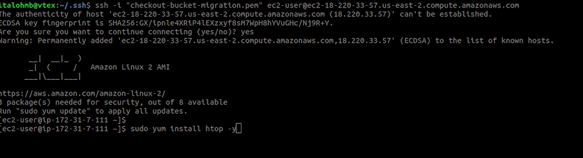

# Migração de dados históricos do Checkout

## Motivação

Após a implementação do _pipeline_ para estruturação e particionamento dos dados do Checkout, todos os novos pedidos criados passam a ser salvos numa primeira versão pronta para consumo/consulta na conta de Analytics. Contudo, ainda era necessário resgatar todos os dados de pedidos anteriores à implementação do nosso _pipeline_. Nesse sentido, este documento descreve como se deu o processo de migração de dados históricos do Checkout e como fizemos para transformar esses dados para terem o mesmo formato que aqueles produzidos pelo _pipeline_ para o datalake.

## Migração de Dados

Os dados do Checkout são salvos em um bucket s3 na região da Virgínia. O bucket da conta de Analytics onde salvamos os dados transformados está por sua vez salvo na região de Ohio. Portanto, o problema que estamos querendo resolver nesta parte é **a cópia de dados entre buckets em diferentes regiões e em diferentes contas**.

Para a migração, utilizamos o serviço EC2 para provisionar **16 instâncias** de alta capacidade (**flavor: m5.4xlarge, com 16 VCPus, 64 Mem**). Por quê 16 instâncias? Ao todo, iríamos copiar 512 pastas do bucket de origem (216 pastas de checkoutOrder e 216 fulfillmentOrder, de acordo com a estrutura de pastas do bucket). Decidimos  que cada máquina seria responsável por fazer a cópia de 32 pastas, de modo que 16 * 32 = 512. Chegams ao número 32 após alguns experimentos, e vimos que uma máquina poderia cópiar 32 pastas em até um dia, o que era um cenário ainda bom.

### Permissões

Antes de tudo, para haver a cópia de dados entre diferentes contas, é preciso que permissões sejam concedidas para serviços específicos entre as contas. No nosso caso, duas permissões necessitam ser declaradas:

1. O bucket de origem de dados (no caso, o do Checkout) precisa anexar uma policy no bucket, acessando o menu Permissoes/Bucket Policy. Deve ser algo parecido com:

```json
{
   "Version": "2012-10-17",
   "Statement": [
      {
         "Sid": "Migrate checkout objects to datalake",
         "Effect": "Allow",
         "Principal": {
            "AWS": "arn:aws:iam::<iam-id>:root"
         },
         "Action": [
            "s3:*"
         ],
         "Resource": [
            "arn:aws:s3:::<source-bucket>",
            "arn:aws:s3:::<source-bucket>/*"
         ]
      }
   ]
}
```

Esta policy _permite_ no _bucket indicado_ a realização de _qualquer ação relativa ao s3_.

> **WARNING**: Obviamente, esta policy deve ser usada com precaução. Portanto, logo após ao fim do processo de cópia dos dados, ela deve ser excluída.

2. Na hora de requisitar instâncias, é preciso associa-las a um IAM Role que dê **s3:fullAcess**. Tocaremos nesse ponto novamente mais à frente.

3. Também é necessário adicionar uma bucket policy no bucket de destino. Essa policy precisa dar acesso a ações de list, get e put.

```json
{
    "Version": "2012-10-17",
    "Statement": [
        {
            "Sid": "Stmt1563475184681",
            "Effect": "Allow",
            "Principal": {
                "AWS": [
                    "arn:aws:iam::282989224251:role/EMR_EC2_DefaultRole",
                    "arn:aws:iam::282989224251:role/EMR_DefaultRole"
                ]
            },
            "Action": [
                "s3:Get*",
                "s3:List*",
                "s3:Put*"
            ],
            "Resource": [
                "arn:aws:s3:::target-bucket",
                "arn:aws:s3:::target-bucket/*"
            ]
        }
    ]
}
```

### Requisitando Instâncias

Primeiramente, é necessário garantir que você esteja requisitando uma instância que esteja na mesma região do bucket de origem (para a VTEX, no geral essa região é a virgígina/us-east-1). Usando a UI, você pode alterar a região no menu do meio no canto direito superior da tela.   
Acesse o EC2 na AWS e clique em _Launch Instance_. 

1. Selecione o seguinte AMI: `Amazon Linux 2 AMI (HVM), SSD Volume Type`. _Next_.
2. Selecione o seguinte tipo de instância: `m5.4xlarge`. _Next_.
3. Indique:
    - Número de instâncias: 16
    - Em IAM Role, indique ou crie um que dê s3:FullAcess (como falamos anteriormente).  
    - Auto-assign public IP: enabled.
4. Pule.
5. Adicione as tags apropriadas.
6. Selecione ou crie um novo grupo de segurança. É importante que no grupo de segurança usado haja uma regra que conceda acesso SSH para seu ip.
    - Para editar um grup já existente, clique no grupo de segurança
      - Na aba Inbound, clique em Edit para adicionar uma nova regra (SSH, TCP, 22, My Ip) e Salve.  
      - 
   - Se desejar criar um novo grupo de segurança, adicione regras que lhe dê acesso ssh como comentado acima.
7. Revise as informações e clique em `Launch` (selecione ou crie um nova chave de segurança).

### Copiando arquivos

Para copiar os dados do bucket de origem, é preciso executar um comando do `aws cli` chamado `sync`. A instância criada no passo anterior já vem com o aws cli instalado (por causa do AMI selecionado no passo 1). Execute o comando dentro da instância.

#### Conectando-se à instância

Volte para a home do EC2, clique em `Instâncias`, selecione a instância criada, clique em `Connect`, leia as instruções e reproduza-as.


OBS: você precisa ter a chave indicada no passo 7 para acessar a máquina.

Abra o terminal, acesse a instância. Instale o comando htop. 



#### Sync de dados

Para cada instância, rode os 32 comandos (cada comando representando o sync de uma pasta) a ela atribuídos. 

Ex de comando sync:   
```
aws s3 sync --quiet <s3:source_path> <s3:target_path> &
```

Acompanhe no EC2/instance/monitoring ou com o htop o processo de transferência de dados.


Esse documento se baseis no [docs](https://docs.google.com/document/d/1LFyubm8vLXcrdPxL09WxzKsvQ-HMmirGIqZBZazuCf0/edit#) criado quando da migração específica dos dados do checkout.


## Transformação de Dados

Depois de copiados para a conta de Analytics, os dados do Checkout encontram-se crús. Eles precisam ser transformados (estruturados) e particionados. Como se trata de um conjunto de dados muito grande (aprox 4 terabytes), decidimos usar um [script](https://github.com/vtex/datalake/tree/master/aws/EMR/partitioning_history_checkout_data) em pyspark.   
Para executar os spark jobs, decidimos fazê-lo num contexto de um cluster criado com o serviço EMR da aws. Mas com qual configuração criar esse cluster, de modo a melhor utilizar os recursos das máquinas e finalizar os processamentos com sucesso?  
Ao longo dos experimentos realizados, tivemos alguns problemas de estouro de memória ou de mal uso de recursos ou de exagerado tempo de execução necessário para concluir os jobs. Após alguns testes, chegamos à seguinte configuração:

Foram utilizados 32 clusters, cada qual com a seguinte configuração:
   - 1 máquina Master do tipo r5.2xlarge
   - 2 máquinas Core do tipo c5.4xlarge

> **WARNING**: Importante ressaltar que nem sempre, quando se usam máquinas com grandes recursos, o spark executa os jobs utilizando ao máximo esses recursos. É precio declarar explicitamente a quantidade de memória que o spark pode consumir, a quantidade de paralelização (CPU's), etc. Portanto, utilizamos [este script](https://github.com/vtex/datalake/blob/master/aws/EMR/partitioning_history_checkout_data/gen_config_cluster_spark.py) para configurar os clusters, de modo a melhor utilizar os recursos das instâncias.

Cada cluster é responsável por transformar 16 pastas (dividir para conquistar). Por exemplo:   
- cluster A fica com as pastas 00_CheckourtOrder, 01_CheckoutOrder, ..., 0E_CheckoutOrder, 0F_CheckoutOrder
- cluster B é resposável por 40_FulfillmentOrder, 41_FulfillmentOrder, ..., 4E_FulfillmentOrder, 4F_FulfillmentOrder.   

Cada pasta deve corresponder a um spark job. Portanto, depois de criado um cluster, cada pasta deve ter um _step_ associado. Esse _step_ significa exatamente submeter o script de particionamento a uma pasta (ex: 41_FulfillmentOrder). Isso é possível porque o [script](https://github.com/vtex/datalake/tree/master/aws/EMR/partitioning_history_checkout_data) recebe como argumento uma pasta ([leia](https://github.com/vtex/datalake/tree/master/aws/EMR/partitioning_history_checkout_data) mais sobre como o script funciona). Utilizamos _[outro script](https://github.com/vtex/datalake/tree/master/scripts/checkout_partition_history)_ para criar todos os clusters necessários para transformar e particionar os dados do Checkout, indicando em cada um deles já um step específico para uma subpasta, passada como argumento.

### Problemas enfrentados

Alguns problemas iam surgindo durante os processos de transformação e configuração dos clusters. Aqui relataremos quais problemas foram esses e como resolvemos. 

O processo de estruturação dos dados do checkoutOrder ocorreu sem problemas próprios dos dados. O mesmo não ocorreu com os dados do fulfillmentOrder.   
   - Algumas steps não foram executados porque as pastas relacionada ao step não existia em nossos bucket no s3. Com isso, descobrimos que o processo de migração de dados (descrito acima) falhou para três pastas do fulfillmentOrder (E9__FulfillmentOrder, ED__FulfillmentOrder, FA__FulfillmentOrder).   
   - Algumas pastas (50_FulfillmentOrder, F0_FulfillmentOrder, D0_FulfillmentOrder, C0_FulfillmentOrder) falharam após dois minutos de execução do spark job. Acredita-se que seja um problema de carga relacionado a infraestrutura da AWS, pois disparamos todos os 16 clusters na mesma hora, e os primeiros steps (*0_FulfillmentOrder) de alguns clusters falharam sem mensagem de erro específica. Além disso, ao fim de todo o restante do processo, apenas executamos esses 4 steps novamente (sem qualquer alteração) e eles executaram sem erro algum.
   - Houve falhas nas pastas [22, 0D, 1D, 83, FE, F9]_FulfillmentOrder, relacionadas a um problema ocorrido dia 31/out/2018 às 14 h que gerou arquivos com nomes com caracteres especiais. O Spark quebrou quando tentou ler esses arquivos, pois foi acusado que os caminhos para os arquivos não existiam. Felizmente, as mensagens de erro indicavam qual _path_ havia quebrado a execução. Decidimos renomear os arquivos especificos, retirando os caracteres especiais, e reexecutamos os jobs.
   - A estruturação da pasta 86_FulfillmentOrder falhou porque havia subpastas dentro dos caminhos abaixo de */id/. Essas subpastas são anomalias dentro da estrutura de pastas do bucket. O script tenta ler qualquer json que esteja logo abaixo de /id/. E então quando o spark lista os caminhos dos arquivos que ele lerá, os caminhos para arquivos dentro dessas subpastas são mal formados (ele espera um json e encontra uma pasta),gerando espaços em branco que, na posterior tentativa de ler, levam a caminhos inexistentes.

