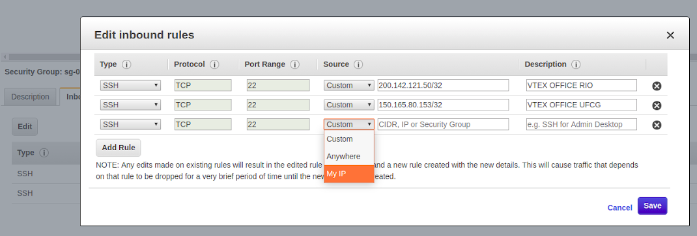
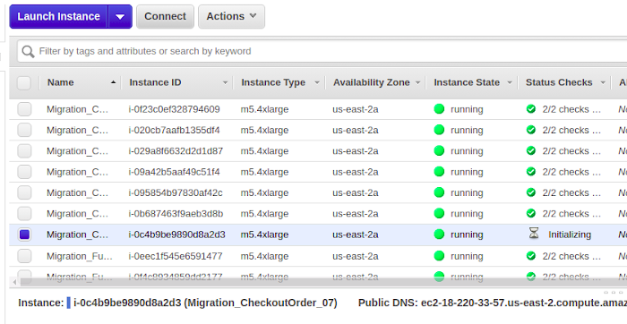
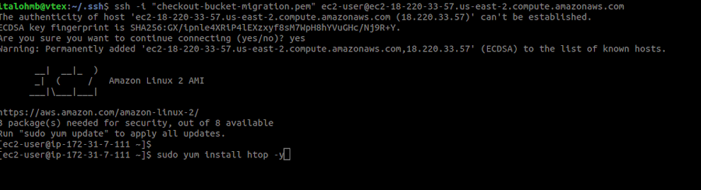

# OMS Historical Data Migration

- [Preamble](#Preamble)
- [Data Migration](#Data-Migration)
    - [Permissions](#Permissions)
    - [Launching instances](#Launching-instances)
    - [Copying files](#Copying-files)
        - [Connecting to the instance](#Connecting-to-the-instance)
        - [Syncing data](#Syncing-data)
- [Data Transformation](#Data-Transformation)
    - [Faced problems](#Faced-problems)

## Preamble

Because OMS bucket replication was performed long after the (source) bucket began storing data, you must redeem all files saved in the source bucket that were prior to replication. In this regard, this document describes how the process of migrating of OMS historical data took place.

## Data Migration

OMS data is saved on s3 bucket in the Virginia region. The Analytics bucket where we save migration data is in the Ohio region. So the problem we are trying to solve is **copying data between buckets in different regions between two different accounts**.

For migration, we used EC2 service to provision **16 instances** of high capacity (**type: m5.4xlarge, with 16 VCPus, 64 Mem**). 

### Permissions

First and foremost, permissions must be granted for specific services in order to data be copied between different accounts. In our case, two permissions need to be declared:

1. The data source bucket (in this case, the Checkout one) must have a bucket policy attached to it. It can be  accomplished by accessing the Permissions / Bucket Policy menu. The bucket policy should look something like:

```json
{
   "Version": "2012-10-17",
   "Statement": [
      {
         "Sid": "Migrate checkout objects to datalake",
         "Effect": "Allow",
         "Principal": {
            "AWS": "arn:aws:iam::<iam-id>:root"
         },
         "Action": [
            "s3:*"
         ],
         "Resource": [
            "arn:aws:s3:::<source-bucket>",
            "arn:aws:s3:::<source-bucket>/*"
         ]
      }
   ]
}
```

This policy _allows any list, get and put s3 action_ on the indicated bucket.

> **WARNING**: Obviously, this policy should be used with caution. Therefore, immediately after the data copying process has been completed, it should be deleted.

2. When launching instances, you must associate them with an IAM Role that gives **s3: fullAcess**. We will cover that point again later.

3. It is also necessary to add a bucket policy at the target bucket. This policy needs to allow list, get and put actions.

```json
{
    "Version": "2012-10-17",
    "Statement": [
        {
            "Sid": "Stmt1563475184681",
            "Effect": "Allow",
            "Principal": {
                "AWS": [
                    "arn:aws:iam::282989224251:role/EMR_EC2_DefaultRole",
                    "arn:aws:iam::282989224251:role/EMR_DefaultRole"
                ]
            },
            "Action": [
                "s3:Get*",
                "s3:List*",
                "s3:Put*"
            ],
            "Resource": [
                "arn:aws:s3:::vtex-analytics-import",
                "arn:aws:s3:::vtex-analytics-import/*"
            ]
        }
    ]
}
```

### Launching instances

First, you need to ensure that you are launching an instance that is in the same region as the source bucket (for VTEX, this region is usually virgin / us-east-1). Using the UI, you can change the region in the middle menu in the upper right corner of the screen.

Access EC2 on AWS and click _Launch Instance_.

1. Select the following AMI: `Amazon Linux 2 AMI (HVM), SSD Volume Type`. _Next_.
2. Select the following instance type: `m5.4xlarge`. _Next_.
3. Indicate:
     - Number of instances: 16
     - In IAM Role, indicate or create one that gives s3: FullAcess (as we mentioned earlier).
4. Jump.
5. Add the appropriate tags.
6. Select or create a new security group. It is important that in the security group used there is a rule that grants SSH access to your ip.
     - To edit an existing group, click on the security group.
       - In the Inbound tab, click Edit to add a new rule (SSH, TCP, 22, My Ip) and Save.
       - 
    - If you want to create a new security group, add rules that give you ssh access as commented above.
7. Review the information and click `Launch` (select or create a new security key).

We requested 16 instances because in the source bucket the OMS data is divided in folders named with hexadecimal representation. So, in each instance we requested we would do the migration for folders only prefixed by one from the sixteen hexadecial chars.

### Copying files

To copy the data from the source bucket, you must execute a `aws cli` command called `sync`. The instance created in the previous step already comes with aws cli installed (because of the AMI selected in step 1). 
However, to automate the executation of the sync command, we created alternative scripts to list and sync every file on the source bucket. It happens that the sync command lists files if you try to sync a directory, making requests to s3. But we know that the source Orders bucket is extremely divided, with so many inner folders. So simply running on the root of the bucket would consume more time and price than previsouly listing all files on bucket. And we can do it, listing files, because we know the structure of folders on source bucket (hexadecimal prefixes).

#### Connecting to instances

Go back to EC2 home page, click on menu "Instances", select the one previously launched, click on "Connect" and follow instructions.



NOTE: You must have the key indicated in step 7 to access the machine.

Open the terminal, access the instance. Install the htop command.



#### Syncing data

When connected to the EC2 instance, download the [sync scripts](https://github.com/vtex/datalake/tree/master/projects/orders-migration/sync-scripts). They are also [saved on s3](https://s3.console.aws.amazon.com/s3/buckets/vtex.datalake/scripts/migration_orders_script_gen/?region=us-east-2&tab=overview), so you can 

`aws s3 cp s3://vtex.datalake/scripts/migration_orders_script_gen/ ./ --exclude "*" --include "*.sh"` to download them.

1. The first script `script1-migrate-gen.sh` generates several identical subscripts, each one with several sync commands lines. The difference between the files is the hexadecimal prefix (with 4 chars) they list (ex: one file list F140* and another one list for F141*). Theses scripts are saved ona folder called /scripts-migrate. The `script1-migrate-gen.sh` receives a argument, that can be [0-9A-F]. Each EC2 instance will migrate one prefix, from 0 to F. So in each instance you will run `script1-migrate-gen.sh` (and next scripts) passing the appropriate hexadecimal prefix for the instance.

2. The second script `script2-exec-migration.sh` will run the sync command on /scripts-migrate scripts and save thair outputs, including errors.

Due to the large charge of requests on syncing so many files, errors will happen. So the next two scripts read the output files saved on step 2 above, get the files that could not be synced and retry them.

3. The third script `script3-gen_cp_from_log.py` read output files from a directory (passed as --logs-dir argument) and append a command sync (for each file whose sync did not complete previsouly) to a file you pass as --output-script argument.

4. Finally the last script read the output script from the step before (but you must indicate it as --input-script) and generates a final script (--output-script) parallelizing the executation of the sync (this saves times when running this output script on instances with multiple vCPUs)