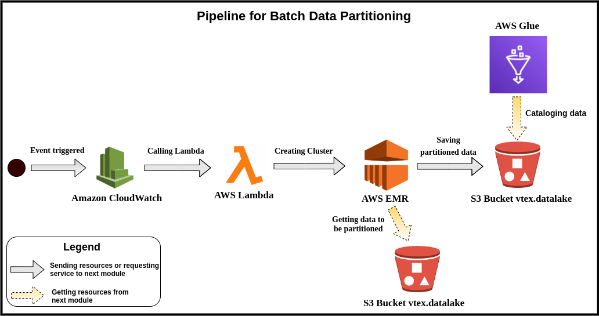

# **Pipeline para a formação do Data Lake de Checkout**

# **Índice**

- [Motivação](#Motivação)
- [Pipeline](#Pipeline)
    - [Reestruturação e Organização dos dados em Streaming](#Reestruturação-e-Organização-dos-dados-em-Streaming)
        - [Obtenção de dados brutos de Checkout no Amazon S3](#Obtenção-de-dados-brutos-de-Checkout-no-Amazon-S3)
        - [Notificação, a partir do SNS, de novos dados obtidos](#Notificação,-a-partir-do-SNS,-de-novos-dados-obtidos)
        - [Pré-processamento dos dados brutos com AWS Lambda](#Pré-processamento-dos-dados-brutos-com-AWS-Lambda)
        - [Escrita dos dados estruturados em um novo bucket no S3](#Escrita-dos-dados-estruturados-em-um-novo-bucket-no-S3)
        - [Inferência do schema dos dados estruturados com o Crawler do Glue](#Inferência-do-schema-dos-dados-estruturados-com-o-Crawler-do-Glue)
        - [Notificação, a partir do SNS, dos dados estruturados](#Notificação,-a-partir-do-SNS,-dos-dados-estruturados)
        - [Particionamento e armazenamento dos dados com o Amazon Kinesis Firehose](#Particionamento-e-armazenamento-dos-dados-com-o-Amazon-Kinesis-Firehose)
    - [Reparticionamento dos dados em Batch](#Reparticionamento-dos-dados-em-Batch)
        - [Definição de uma rotina de execução com Amazon CloudWatch](#Definição-de-uma-rotina-de-execução-com-Amazon-CloudWatch)
        - [Criação de um cluster, a partir do Lambda, para o reparticionamento dos dados ingeridos na última hora](#Criação-de-um-cluster-a-partir-do-Lambda-para-o-reparticionamento-dos-dados-ingeridos-na-última-hora)
        - [Reparticionamento e armazenamento dos dados com o AWS EMR](#Reparticionamento-e-armazenamento-dos-dados-com-o-AWS-EMR)
        - [Catálogo dos dados reparticionados](#Catálogo-dos-dados-reparticionados)

# **Motivação**

A grande quantidade de dados gerados diariamente pela VTEX podem propiciar insights que acarretarão em resultados tangíveis para os parceiros da empresa, ou seja, auxiliarão na visão sobre o desempenho das vendas. No entanto, lidar com essa massiva quantidade de dados não é simples, pois existe uma grande variedade de dados, os quais podem ser ou não estruturados e advirem de diversas fontes, além disso, é pertinente observar que os dados por si só **não** carregam valor para que possam produzir algum tipo de informação. Sendo assim, torna-se necessário definir uma estrutura que possa armazenar e organizar essa coleção de dados, para permitir a extração das informações a partir de técnicas de Analytics e de Machine Learning, por exemplo.

Nesta perspectiva, alguns conceitos foram definidos como possíveis soluções para realizar o armazenamento e a organização dos dados, dos quais o **Data Lake** tem ganhado bastante prestígio. Este conceito define a formação de um repositório onde serão armazenados um grande e variado volume de dados, os quais podem ser estruturados, semi-estruturados ou não estruturados, e a partir dos mesmos pode se realizar diversos tipos de análises. Este conceito se diferencia do **Data Warehouse (DW)**, pois os dados podem ser variados e não é necessária a definição de um schema prévio para os mesmos, ademais é notório observar que é possível formar diversos DW para diversos tipos de análises a partir de um mesmo Data Lake.

Logo, vislumbrou-se a formação de um Data Lake para a VTEX dentro de um **bucket S3 da AWS**, no qual estarão presentes dados advindos de diversas experiências da empresa, como a Checkout. A partir desse repositório poderão ser feitos diversos tipos de análises dos dados para gerarem insights para a empresa e seus parceiros.

Sendo assim, o presente texto busca apresentar a estruturação de um pipeline que porpiciará a formação do Data Lake da VTEX.

# **Pipeline**

O Pipeline construído busca organizar o fluxo de obtenção, transformação, organização e armazenamento dos dados de Checkout no bucket `vtex.datalake` do S3, o qual se configurará como o repositório que representa o **Data Lake** da VTEX. Para isso, deve-se processar os dados de duas formas que se complementam, primeiramente um processamento inicial dos dados em **Streaming** para reestruração e organização, e posteriormente um processamento em **Batch** para o reparticionamento dos dados. Para esse fluxo de processamento foram utilizadas tecnologias da **AWS**, as quais, em sua maioria são serveless, ou seja, não é necessário o desenvolvimento de código, mas apenas a configuração das mesmas para as necessidades do Pipeline.

## **Reestruturação e Organização dos dados em Streaming**

O processamento dos dados em Streaming visa, em tempo real, reestruturar os dados que estão sendo produzidos no bucket S3 do Checkout e organizá-los no novo bucket. Para tanto, existem algumas transformações sequenciais necessárias nestes dados para finalmente armazená-los no Data Lake.

De início, os dados obtidos na leitura do bucket estão em formato JSON, onde os tipos dos valores para cada chave são Strings, não obstante, alguns desses valores representam Arrays ou outros objetos, acarretando em dados pouco representativos. Sendo assim, os mesmos são reprocessados no pipeline para converter essas Strings para o tipo mais específico desse. Posteriormente, elimina-se conteúdos customizáveis, os quais, por si só, carregam pouco valor agregado e não auxiliarão no processo de Analytics. Ademais, esses dados são convertidos para o formato Parquet, o qual se caracteriza por um formato compresso e colunar, o que permite uma leitura mais rápida. Por fim os dados são armazenados em uma pasta `/stage` do bucket `vtex.datalake`, os quais serão processados posteriormente em batch.

A imagem a seguir apresenta o pipeline de processamento dos dados em Streaming.

Como observado na imagem acima, o Pipeline segue um fluxo complexo, onde estão envolvidas várias tecnologias da AWS, as quais em conjunto, proporcionam a conversão de dados brutos em formato parquet. Para tanto, as tecnologias utilizadas são: Amazon S3, Amazon SNS, AWS Lambda, AWS Glue e Amazon Kinesis Firehose.

### **Obtenção de dados brutos de Checkout no Amazon S3**

O Amazon S3 tem uma interface simples de serviços da web, o qual pode ser utilizado para armazenar e recuperar qualquer quantidade de dados, a qualquer momento e em qualquer lugar, buscando oferecer um conjunto mínimo de recursos com foco em simplicidade e robustez. Essa tecnologia oferece a criação de **buckets**, os quais funcionam como contêineres onde poderão ser armazenados dados de vários tipos e em grande volume, organizados da maneira que se desejar. Além disso, cada bucket é identificável de forma única dentro da AWS pelo seu nome.

Tomando-se conhecimento do S3, pode-se entender o início do pipeline, no qual se obtém os dados gerados pelo Checkout. Os mesmos estão armazenados em um bucket do S3 gerenciado pelo próprio time, matendo-se o controle de acesso e a segurança das informações. Logo, para poder manipulá-los, os mesmos são tratados, ou seja, dados sigilosos, como informações pessoais da pessoa que realizou a compra, são criptografados, e posteriormente replicados em um novo bucket chamado `vtex-checkout-versioned-rawdata`, o qual é mantido pelo time de Management XP, propiciando a manipulação desses para os devidos fins do time para análise.

### **Notificação, a partir do SNS, de novos dados obtidos**

O Amazon Simple Notification Service (Amazon SNS) é um web service que coordena e gerencia a entrega ou o envio de mensagens para endpoints ou clientes inscritos. O mesmo segue o padrão Publisher-Subscriber, no qual os produtores se comunicam de maneira assíncrona com os consumidores, a partir do envio de uma mensagem para um **tópico** do SNS. O tópico se configura como um canal de comunicação e um ponto de acesso lógico. Sendo assim, os produtores, por exemplo o S3, enviam mensagens para o tópico e os consumidores (como exemplo, as filas do Amazon SQS e as funções do AWS Lambda) que estão inscritos neste tópico, consomem ou recebem a mensagem ou a notificação.

No contexto do Pipeline, o bucket `vtex-checkout-versioned-rawdata` precisa notificar a chegada de novos dados de Checkout, sendo assim, criou-se o tópico `checkout-sns-topic-1` no SNS e ativou um evento dentro desse bucket para notificar o tópico que um novo dado foi produzido. A partir desta notificação, os consumidores que estão inscritos no devido tópico serão notificados sobre a mensagem, recebendo a informação contida nela, que nada mais é que o dado recém adicionado. Logo, uma função criada no AWS Lambda será notificada de que o dado foi adicionado e essa ficará responsável pelo processamento inicial do dado bruto.

### **Pré-processamento dos dados brutos com AWS Lambda**

O AWS Lambda é um serviço de computação que permite a escrita e execução do código sem provisionar ou gerenciar servidores. Esse serviço executa o código em uma infraestrutura de computação de alta disponibilidade, administrando-se todos os recursos computacionais, o que inclui: manutenção de servidor e sistema operacional, provisionamento de capacidade e escalabilidade automática, monitoramento do código e registro em log.

Esse serviço permite a execução do código em resposta a eventos, como os propiciados em tópicos publicados no SNS. Sendo assim, definiu-se a função `sendCheckoutDataToFirehouse`, acionada sempre que um novo dado de Checkout é enviado como mensagem ao tópico `checkout-sns-topic-1`, e tem **o objetivo de estruturar o dado**, ou seja, converter tipos de dados definidos no schema como String, mas que possuem conteúdos de outros tipos como Array. Além disso, alguns valores desse dado são modificados ou excluídos, pois são valores customizáveis, os quais possuem caracteres especiais, o que problematiza consultas, ou possuem pouco valor agregado. 

No entanto, para realizar esta estruturação, a função no Lambda precisa de permissões de leitura e escrita no S3, as quais são propiciadas a partir do AWS Identity and Access Management (IAM). O IAM é um serviço web que auxilia no controle de acesso aos recursos da AWS de forma segura, no qual é possível criar `roles` que definem as permissões de leitura/escrita, por exemplo, e para qual serviço se destina. Logo, construiu-se uma role chamada `lambda-s3-role` que permite a leitura e escrita em buckets do S3, sendo inserida no lambda como uma **Execution role**, e assim permitir que a função seja executada corretamente.

### **Escrita dos dados estruturados em um novo bucket no S3**

Dado o novo dado de Checkout estruturado na função do Lambda, o mesmo será armazenado na pasta `structured_json` dentro do bucket `vtex.datalake`. Esse armazenamento intermediário ocorre, pois é necessário se inferir um schema dos dados presentes nessa pasta, o qual será utilizado para propiciar a leitura dos dados pelo Amazon Kinesis Firehose.

### **Inferência do schema dos dados estruturados com o Crawler do Glue**

O AWS Glue consiste em um repositório de metadados central conhecido como o **Catálogo** de dados do AWS Glue, além de um serviço de ETL (extração, transformação e carregamento) totalmente gerenciado. Esse serviço não usa servidor e, portanto, não requer a configuração ou o gerenciamento de uma infraestrutura. Uma das principais ferramentas do Glue é o **crawler**, o qual tem a função de ler um conjunto de dados definidos, inferir um schema sobre os mesmos e preencher o Catálogo de dados com a nova tabela criada.

Utilizando-se o serviço de crawler, e sabendo-se que o mesmo pode ser invocado sobre demanda ou em rotinas de tempo (a cada 1 hora, por exemplo), configurou-se o crawler chamado `checkoutOrder` para ser executado sobre demanda, e inferir o schema dos dados estruturados presentes no bucket `vtex.datalake/structured_json`, gerando-se a tabela `raw_checkout` presente no database `checkout`. Vale-se salientar que a execução foi definida como sobre demanda para ter um maior controle sobre a tabela que está sendo gerada.

### **Notificação, a partir do SNS, dos dados estruturados**

Assim como no primeiro procedimento do Pipeline de envio de mensagens entre o bucket e o SNS, neste ponto atual do Pipeline ocorre uma notificação sobre o evento de novos dados sendo inseridos dentro do bucket `vtex.datalake/structured_json`, o qual é enviado ao tópico `TestNewStructuredJsonData`, e uma nova função lambda será notificada sobre o evento.

### **Particionamento e armazenamento dos dados com o Amazon Kinesis Firehose**

Ao ser notificada sobre a presença de um novo dado, a função `sendStructuredJsonToFirehose` criada no Lambda e com a role `lambda-s3-role`, funciona como uma ponte, lendo esse novo dado e o enviando para o **Firehose**.

O Amazon Kinesis Firehose é um serviço totalmente gerenciado para entrega de dados em streaming em tempo real a destinos como o Amazon S3. O mesmo permite a reescrita dos dados em outros fomatos e o reparticionamento dos mesmos. Essa ferramenta foi utilizada com o intuito de processar os dados em streaming, reescrevendo-os em formato Parquet, pois é um formato mais compresso e organizado de forma colunar para permitir uma leitura mais rápida. Além disso, os dados são reparticionados por data de ingestão, o que proporciona um reprocessamento mais rápido e organizado posteriormente.

Logo, para o uso da ferramenta, criou-se um **delivery stream** chamado de `DataStreamStructuredCheckout`, no qual foi necessário criar uma nova role `firehose_delivery_role`, a qual permite a leitura e escrita no S3, além de leitura no Glue e no próprio Kinesis. A permissão sobre o Glue é necessária, pois o Firehose precisa da tabela `raw_checkout` para poder ler os dados em streaming. Além disso, foi-se configurado um buffer de **128 mb** na ferramenta, para algomerar mais dados de checkout e convertê-los em unidade para Parquet. Por fim, os dados foram particionados por data de ingestão (ano, mês, dia e hora) dos mesmos, pois esses dados serão posteriormente reprocessados em lotes por hora.

Os dados estruturados, reescritos em novo formato e reparticonados serão armazenados na pasta `/stage` do bucket `vtex.datalake`, concluindo-se a etapa streaming do Pipeline.

## **Reparticionamento dos dados em Batch**

Ao final do processo dos dados de Checkout em Streaming, os mesmos se encontram estruturados, no formato Parquet e particionados. Não obstante, este particionamento não é o mais ideal, pois o mesmo realiza a divisão de acordo com a ingestão dos dados, o que não é necessariamente equivalente a data de geração/atualização dos dados. O Firehose não permite definir as partições de acordo com valores internos do próprio objeto, donde buscaria-se a data correta, sendo assim, foi-se desenvolvido um fluxo extra para lidar com esta limitação, no qual os dados serão reparticionados em um Pipeline em Batch, sendo executado em uma rotina por hora.

> **OBSERVAÇÃO**: Apesar de o Firehose não proporcionar o particionamente ideal, o mesmo ainda se mantém em uso, pois a divisão pela data de ingestão permite a execução de rotinas de hora em hora para obter os dados da última hora de ingestão, por exemplo, no horário das 10h, uma rotina será disparada e processará todos os dados do lote das 9h até às 10h, e assim permitir o reparticionamento automático dos dados.

A imagem a seguir apresenta o fluxo do Pipeline em Batch.

### **Definição de uma rotina de execução com Amazon CloudWatch**

O Amazon CloudWatch monitora, em tempo real, os recursos e os aplicativos em execução na AWS, proporcionando a coleta e o monitoramento de métricas extraídas desses. Além disso, esse serviço oferece a criação de **Eventos** que se encarregam de gerar um fluxo quase em tempo real dos eventos de alterações nos recursos da AWS, podendo-se definir **regras** que associam cada evento a um ou mais fluxos ou funções de destino.

Sendo assim, para que o Pipeline em Batch se inicie, foi-se configurado uma regra no CloudWatch, o qual segue uma rotina de hora em hora. Essa regra foi definida como `checkout_partition_routine_trigger` e é disparada sempre no **décimo minuto de cada hora do dia**, ativando o alvo específico que é uma nova função Lambda.

### **Criação de um cluster, a partir do Lambda, para o reparticionamento dos dados ingeridos na última hora**

Dada a definição da rotina de execução a cada uma hora propiciada pela regra no CloudWatch, uma função no Lambda definida como `submitPartitionRoutineCluster` é ativada sempre que o evento ocorre e se responsabiliza em criar um novo **cluster** no AWS EMR para realizar o reparticionamento dos dados da última hora. As configurações para a criação do cluster é descrito no seguinte [link](https://github.com/vtex/datalake/tree/master/aws/lambda/submitPartitionRoutineCluster).

### **Reparticionamento e armazenamento dos dados com o AWS EMR**

O Amazon EMR é uma plataforma de cluster gerenciada que simplifica a execução de estruturas de Big Data, como o Apache Hadoop e o Apache Spark, na AWS para processar e analisar grandes quantidades de dados. Usando essas estruturas e projetos de código-fonte aberto relacionados, como o Apache Hive e o Apache Pig, pode-se processar dados para fins de análises. Além disso, pode-se usar esse serviço para transformar e mover grandes quantidades de dados de e para outros armazenamentos de dados e bancos de dados da AWS, como o Amazon S3 e o Amazon DynamoDB.

Logo a função `submitPartitionRoutineCluster` definida no Lambda, cria um novo cluster no EMR, o qual se responsabilizará por ler os dados armazenados na última hora de execução no `s3://vtex.datalake/stage`, reparticionando-os por dia, mês e ano da data da última atualização do dado, o qual é obtido a partir do valor da chave `lastChange` presente em cada objeto. Para tanto, utilizou-se o **Spark**, ferramenta que proporciona eficiência na leitura, repartição e escrita de uma extensa quantidade de dados, pois distibui estas atividades entre os nós do cluster, seguindo a arquitetura do MapReduce.

Os dados lidos e reparticionados, a partir do Spark, são finalmente armazenados no bucket `s3://vtex.datalake/consumable_tables`, o qual representará os dados finais preparados para análises futuras.

### **Catálogo dos dados reparticionados**

Com os dados estruturados, reparticionados e armazenados no S3, pode-se ativar um novo Crawler no Glue chamado `consumable_checkout_crawler`, o qual será responsável pela inferência do schema final dos dados com suas respectivas partições. A partir da ação do crawler, uma nova tabela será catalogada pelo nome de `checkout` no database `checkout`. Por fim, pode-se observar que assim como o crawler definido para ler os dados do `vtex.datalake/structured_json`, este novo serviço é acionado apenas sobre demanda, pois mantém o controle sobre o schema inferido.