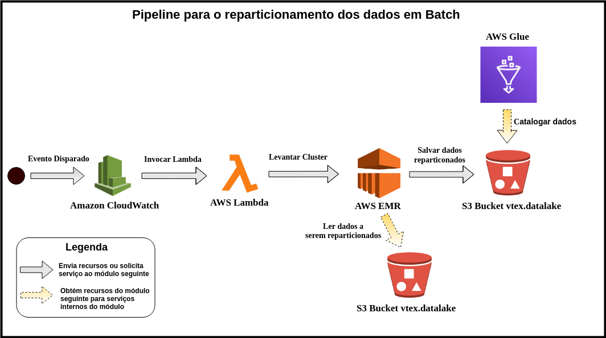

# **Pipeline for Data Lake Checkout generation**

# **Index**

- [1. Motivation](#1.-Motivation)
- [2. Pipeline](#2.-Pipeline)
    - [2.1 Streaming Data Restructuring and Organization](#2.1-Streaming-Data-Restructuring-and-Organization)
        - [2.1.1 Getting Raw Checkout Data on Amazon S3](#2.1.1-Getting-Raw-Checkout-Data-on-Amazon-S3)
        - [2.1.2 Notification, from the SNS, about the new data obtained](#2.1.2-Notification,-from-the-SNS,-about-the-new-data-gotten)
        - [2.1.3 Raw data preprocessing with AWS Lambda](#2.1.3-Raw-data-preprocessing-with-AWS-Lambda)
        - [2.1.4 Writing structured data in a new bucket in S3](#2.1.4-Writing-structured-data-in-a-new-bucket-in-S3)
        - [2.1.5 Structured Data Schema Inference with Glue's Crawler](#2.1.5-Structured-Data-Schema-Inference-with-Glue's-Crawler)
        - [2.1.6 Notification, from the SNS, about structured data](#2.1.6-Notification,-from-the-SNS,-about-structured-data)
        - [2.1.7 Partitioning and Storage Data with Amazon Kinesis Firehose](#2.1.7-Partitioning-and-Storage-Data-with-Amazon-Kinesis-Firehose)
    - [2.2 Batch Data Partitioning](#2.2-Batch-Data-Partitioning)
        - [2.2.1 Defining a execution routine with Amazon CloudWatch](#2.2.1-Defining-a-execution-routine-with-Amazon-CloudWatch)
        - [2.2.2 Creation of a cluster from Lambda for partitioning last-minute data](#2.2.2-Creation-of-a-cluster-from-Lambda-for-partitioning-last-minute-data)
        - [2.2.3 Data Partitioning and Storage with AWS EMR](#2.2.3-Data-Partitioning-and-Storage-with-AWS-EMR)
        - [2.2.4 Partitioned Data Catalog](#2.2.4-Partitioned-Data-Catalog)

# **1. Motivation**

The large amount of data generated daily by VTEX can provide insights that will lead to tangible results for the company's partners, which will aid in insight into sales performance. However, dealing with this massive amount of data is not simple, as there is a large variety of data, which may or may not be structured and come from a variety of sources, and it is pertinent to note that the data itself **is not** have value so that they can produce some kind of information. Thus, it is necessary to define a structure that can store and organize this data collection, allowing the extraction of information from Analytics and Machine Learning techniques, for example.

Therefore, some concepts have been defined as possible solutions for storing and organizing data, of which **Data Lake** has achieved a great deal of prestige. This concept defines the formation of a repository where a large and varied volume of data will be stored, which can be structured, semi-structured or unstructured, and from these can be performed various types of analysis. This concept differs from **Data Warehouse (DW)**, as data can be varied and it isn't necessary to define a previous schema for it, besides it is noticeable to see that it is possible to form several DW for different types of analysis from the same Data Lake.

Thus, we envisioned the generation of a Data Lake for VTEX within an **bucket S3 from AWS**, which will present data from various experiences of the company, such as Checkout. From this repository, many types of data analysis can be done to generate insights for the company and its partners.

In this perspective, the present text seeks to present the structuring of a pipeline that will shape the formation of VTEX Data Lake.

# **2. Pipeline**

The built Pipeline is intended to organize the flow of obtaining, transforming, organizing and storing Checkout data in the S3 `vtex.datalake` bucket, which will be configured as the repository representing VTEX **Data Lake** . To do this, we must process the data in two complementary ways, first an initial processing of the **Streaming** data for restructuring and organization, and then a **Batch** processing for the data partitioning. **AWS** technologies were used for this processing flow.

## **2.1 Streaming Data Restructuring and Organization**

Streaming data processing is intended, at real time, to restructure the data produced in the Checkout S3 bucket and organize it into the new bucket. To do so, there are some sequential transformations needed in this data to finally store it in Data Lake.

At first, the data obtained by reading the bucket is in JSON format, where the value types for each key are Strings, however, some of these values ​​represent Arrays or other objects, resulting in unrepresentative data. As such, they are reprocessed in the pipeline to convert these strings to the more specific type of strings. Subsequently, customizable content is eliminated, which by itself has little added value and will not add to the Analytics process. In addition, this data is converted to Parquet format, which is characterized by a compressed and columnar format, which allows for faster reading. Finally the data is stored in a `/ stage` folder in the` vtex.datalake` bucket, which will be processed later in batch.

The following image shows the data processing pipeline in Streaming.

As noted in the image above, the Pipeline has a complex flow, which involves many AWS technologies, which together provide the conversion of raw data into parquet format. The technologies used are: Amazon S3, Amazon SNS, AWS Lambda, AWS Glue and Amazon Kinesis Firehose.

### **2.1.1 Getting Raw Checkout Data on Amazon S3**

Amazon S3 has a simple web services interface that can be used to store and retrieve any amount of data, anytime and anywhere, while offering a minimal set of features focused on simplicity and robustness. This technology offers the creation of **buckets**, which act as containers where data of various types and large volume can be stored, organized as desired. In addition, each bucket is uniquely identifiable within AWS by its name.

By knowing S3, you can understand the beginning of the pipeline, where you get the data generated by Checkout. They are stored in a team-managed S3 bucket, killing access control and information security. Therefore, in order to be able to manipulate them, they are treated, that is, sensitive data, such as personal information of the person who made the purchase, is encrypted, and later replicated in a new bucket called `vtex-checkout-versioned-rawdata`, which is maintained by the Management XP team, providing the manipulation of these for the proper purposes of the team for analysis.

### **2.1.2 Notification, from the SNS, about the new data gotten**

Amazon Simple Notification Service (Amazon SNS) is a web service that coordinates and manages the delivery or sending of messages to endpoints or subscribed customers. It follows the Publisher-Subscriber standard, in which producers communicate asynchronously with consumers by sending a message to an SNS **topic**. The topic is configured as a communication channel and a logical access point. As such, producers, for example S3, send messages to the topic, and consumers (such as Amazon SQS queues and AWS Lambda functions) who subscribe to this topic consume or receive the message or notification.

In the context of the Pipeline, the bucket `vtex-checkout-versioned-rawdata` needs to notify the arrival of new Checkout data, so we created the topic `checkout-sns-topic-1` in SNS and triggered an event within this bucket to notify the topic that new data has been produced. From this notification, consumers who are subscribed to the appropriate topic will be notified of the message, receiving the information contained in it, which is nothing but the newly added data. Therefore, a function created in AWS Lambda will be notified that the data has been added and it will be responsible for the initial processing of the raw data.

### **2.1.3 Raw data preprocessing with AWS Lambda**

AWS Lambda is a computing service that enables code writing and execution without provisioning or managing servers. This service executes code on a high availability computing infrastructure, managing all computing resources, including server and operating system maintenance, automatic provisioning and scalability, code monitoring, and logging.

This service allows code execution in response to events, such as those provided in topics published in the SNS. Thus, the `sendCheckoutDataToFirehouse` function has been defined, triggered whenever a new Checkout data is sent as a message to the` checkout-sns-topic-1` topic, and has **the purpose of structuring the data**, that is, convert data types defined in the schema to String, but which contain contents of other types such as Array. In addition, some values ​​of this data are modified or deleted, as they are customizable values, which have special characters, which queries queries, or have little added value.

However, to perform this structuring, the function in Lambda needs read and write permissions in S3, which are provided from AWS Identity and Access Management (IAM). IAM is a web service that assists in securely controlling access to AWS resources, where you can create `roles` that set read / write permissions, for example, and for which service it is intended. Therefore, a role called `lambda-s3-role` was built that allows reading and writing to S3 buckets, being inserted into lambda as a **Execution role**, and thus allowing the function to execute correctly.

### **2.1.4 Writing structured data in a new bucket in S3**

Structured data in Lambda will be stored in the `structured_json` folder inside the` vtex.datalake` bucket. This intermediate storage occurs because it is necessary to infer a schema of the data present in this folder, which will be used to enable the reading of data by Amazon Kinesis Firehose.

### **2.1.5 Structured Data Schema Inference with Glue's Crawler**

AWS Glue consists of a central metadata repository known as the AWS Glue Data **Catalog**, as well as a fully managed extract, transform, and load (ETL) service. This service doesn't use a server, so doesn't require the configuration or management of an infrastructure. One of Glue's main tools is the **crawler**, which has the function of reading a defined dataset, inferring a schema about them and populating the Data Catalog with the newly created table.

Using the crawler service, and knowing that it can be invoked on demand or on time routines (every 1 hour, for example), we set up the `checkoutOrder` crawler to run on demand, and infer the schema of the structured data present in the `vtex.datalake / structured_json` bucket, generating the `raw_checkout` table in the `checkout` database. It's noteworthy that the execution was defined as on demand to have greater control over the table being generated.

### **2.1.6 Notification, from the SNS, about structured data**

As with the first procedure for sending messages between the bucket and the SNS, at this current point in the Pipeline there is a notification about the event of new data being inserted into the `vtex.datalake/structured_json` bucket, which is sent to the topic `TestNewStructuredJsonData`, and a new lambda function will be notified of the event.

### **2.1.7 Partitioning and Storage Data with Amazon Kinesis Firehose**

When notified of the presence of new data, the `sendStructuredJsonToFirehose` function created in Lambda and role `lambda-s3-role` acts as a bridge, reading this new data and sending it to **Firehose** .

Amazon Kinesis Firehose is a fully managed service for delivering real-time streaming data to destinations such as Amazon S3. It allows the rewriting of data in other formats and the breakdown of them. This tool was used in order to process the data in streaming, rewriting it in Parquet format, because it is a longer format and columnarly organized to allow a faster reading. In addition, data is partitioned by ingestion date, which provides faster and later organized reprocessing.

Therefore, to use the tool, a **delivery stream** was created and called `DataStreamStructuredCheckout`, in which it was necessary to create a new role `firehose_delivery_role`, which allows reading and writing in S3, as well as reading in Glue and Kinesis itself. Permission for Glue is required because Firehose needs the `raw_checkout` table in order to read the streaming data. In addition, a **128 mb or 300 seconds** buffer has been configured in the tool to wrap up more checkout data and convert it to Parquet units. Finally, the data was partitioned by date of ingestion (year, month, day and time), since this data will be later reprocessed in batches per hour.

Structured data, rewritten in a new format and repartitioned will be stored in the `/ stage` folder of the` vtex.datalake` bucket, concluding the streaming step of the Pipeline.

## **2.2 Batch Data Partitioning**

At the end of the Streaming Checkout data process, they are structured, in Parquet format and partitioned. However, this partitioning is not the most ideal, as it divides according to data ingestion, which is not necessarily equivalent to data generation/update date. Firehose doesn't allow you to define partitions according to the internal values ​​of the object itself, from which the correct date would be sought, so an extra flow has been developed to deal with this limitation, in which the data will be repartitioned in a pipeline. Batch, running on a routine per hour.

> **NOTE**: Although Firehose doesn't provide the ideally partitioned, it's still in use because dividing by ingestion date allows you to perform hourly routines to get the last ingestion data, for example, at 10am, a routine will be triggered and will process all batch data from 9am to 10am, thus allowing automatic data sharing.

The following image shows the Batch Pipeline flow.

### **2.2.1 Defining a execution routine with Amazon CloudWatch**

Amazon CloudWatch monitors, in real time, the resources and applications running on AWS, providing the collection and monitoring of metrics extracted from them. In addition, this service offers the creation of **Events** that are responsible for generating a near real-time flow of AWS feature change events, and you can define **rules** that associate each event with any events in more flows or target functions.

Therefore, in order for the Batch Pipeline to start, a CloudWatch rule has been configured which follows an hourly routine. This rule has been set to `checkout_partition_routine_trigger` and is fired every **tenth minute of every hour of the day**, activating the specific target that is a new Lambda function.

### **2.2.2 Creation of a cluster from Lambda for partitioning last-minute data**

Given the hourly execution routine definition provided by the rule in CloudWatch, a Lambda function set to `submitPartitionRoutineCluster` is activated whenever the event occurs and is responsible for creating a new **cluster** in AWS EMR to perform the partitioning of last minute data. The settings for cluster creation are described in the following [link] (https://github.com/vtex/datalake/tree/master/aws/lambda/submitPartitionRoutineCluster).

### **2.2.3 Data Partitioning and Storage with AWS EMR**

Amazon EMR is a managed clustering platform that simplifies the execution of big data structures, such as Apache Hadoop and Apache Spark, on AWS to process and analyze large amounts of data. Using these related open source frameworks and projects, such as Apache Hive and Apache Pig, you can process data for analysis purposes. In addition, you can use this service to transform and move large amounts of data to and from other AWS data stores and databases such as Amazon S3 and Amazon DynamoDB.

So the `submitPartitionRoutineCluster` function defined in Lambda creates a new cluster in EMR, which will be responsible for reading the data stored at the last run time in `s3://vtex.datalake/stage`, partitioning them by day, month and year from the last data update date, which is taken from the value of the `lastChange` key present in each object. To do so, we used **Spark**, a tool that provides efficiency in reading, sharing and writing a large amount of data, because it distributes these activities among the cluster nodes, following the MapReduce architecture.

Data read and repartitioned from Spark is finally stored in bucket `s3://vtex.datalake/consumable_tables`, which will represent the final data prepared for future analysis.

### **2.2.4 Partitioned Data Catalog**

Knowing that the data is structured, repartitioned and stored in S3, you can activate a new Glue Crawler called `consumable_checkout_crawler`, which will be responsible for inferring the final data schema with its respective partitions. From the crawler action, a new table will be cataloged by the name of `checkout` in the database `checkout`. Finally, it should be noted that just like the crawler set to read data from `vtex.datalake/structured_json`, this new service is only triggered on demand as it keeps track of the inferred schema.